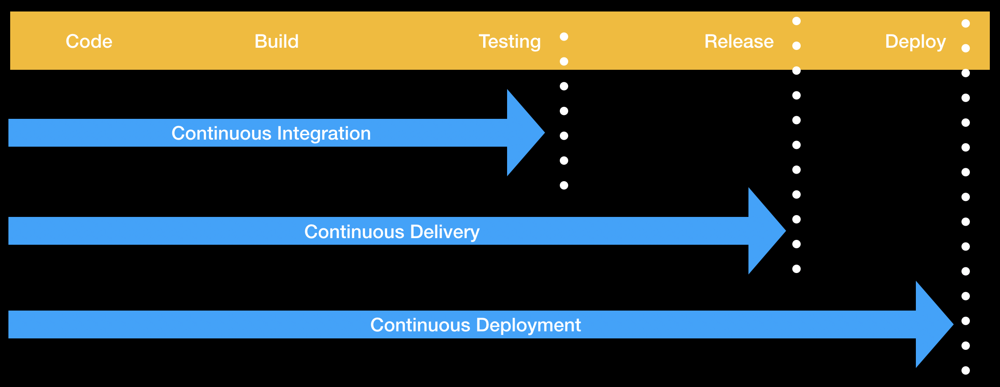

# [Leverage GitHub Actions to publish to GitHub Packages](https://learn.microsoft.com/en-us/training/modules/github-actions-packages/)

## Microsoft Learning path course work

## [Course Excercise Repo](https://github.com/ZakBrinlee/skills-publish-packages)

## What will be covered
- Publish automatically and securely your code libraries or Docker images with GitHub Packages. You'll also run Docker images published into GitHub Packages locally.

## Top Notes
- With the container registry, you can:
  - Store container images within your organization and user account rather than a repository.
  - Set fine-grained permissions for the container images.
  - Access public container images anonymously.
- Relationship between CI, Continuous Delivery and Continous Deployment
- 

## GitHub Packages
- GitHub Packages is a package-management service that makes it easy to publish public or private packages next to your source code.

- **Continuous integration (CI)** is a practice where developers integrate tested code into a shared branch several times per day.
- **Continuous delivery (CD)** is the next phase of **continuous integration (CI)** where we also make sure to package the code in a release and store it somewhere - preferably, in an artifact repository.
- **Continuous deployment (CD)** takes **continuous delivery (CD)** to the next level by directly deploying our releases to the world.
- **Docker** is an engine that allows you to run containers.
- **Dockerfile** is a text document that contains all the commands and instructions necessary to build a Docker Image.
- **Docker image** is an executable package comprised of code, dependencies, libraries, a runtime, environment variables, and configuration files.
- **Docker container** is a runtime instance of a Docker Image.
- 
